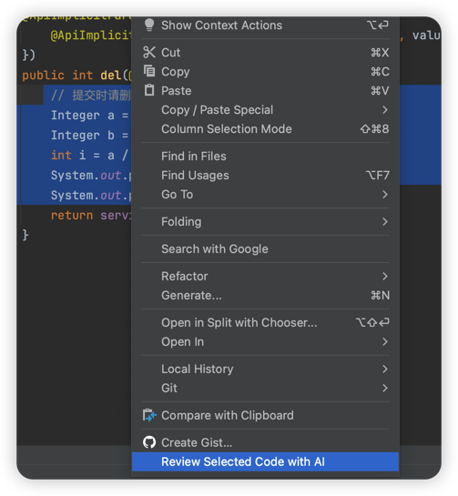

# AI Code Review Plugin

<div align="center">
  
  <h3>智能代码评审插件</h3>
  <p>为 IntelliJ IDEA 提供 AI 驱动的代码评审功能</p>
</div>

## 📋 项目简介

AI Code Review Plugin 是一个专为 IntelliJ IDEA 开发的智能代码评审插件。它集成了先进的 AI 技术，能够在您提交代码时自动进行代码分析和评审，帮助开发者提高代码质量、发现潜在问题并提供改进建议。

## ✨ 核心特性

- 🤖 **AI 智能分析**：基于大语言模型的深度代码分析
- 🔍 **实时评审**：在 Git 提交时自动触发代码评审
- 📊 **多维度检查**：代码质量、性能、安全性、最佳实践全覆盖
- 🎯 **精准定位**：准确标识问题代码位置和具体问题
- 💡 **智能建议**：提供具体的代码改进建议和修复方案
- 🌐 **多语言支持**：支持 Java、Python、JavaScript、TypeScript 等主流语言
- ⚙️ **灵活配置**：支持自定义 AI 模型和评审规则
- 🔗 **无缝集成**：完美融入 IntelliJ IDEA 工作流

## 🛠️ 系统要求

- **IDE 版本**：IntelliJ IDEA 2023.1 或更高版本
- **Java 版本**：JDK 17 或更高版本
- **网络连接**：需要访问 AI 服务接口
- **操作系统**：Windows、macOS、Linux

## 📦 安装方法

### 方式一：插件市场安装（推荐）

1. 打开 IntelliJ IDEA
2. 进入 `File` → `Settings` → `Plugins`
3. 在 Marketplace 中搜索 "AI Code Review"
4. 点击 `Install` 安装插件
5. 重启 IDE 完成安装

### 方式二：本地安装

1. 从 [Releases](../../releases) 页面下载最新版本的 `.zip` 文件
2. 打开 IntelliJ IDEA
3. 进入 `File` → `Settings` → `Plugins`
4. 点击 ⚙️ 图标，选择 `Install Plugin from Disk...`
5. 选择下载的插件文件
6. 重启 IDE

## ⚙️ 配置说明

### 基础配置

安装完成后，需要配置 AI 服务参数：

1. 进入 `File` → `Settings` → `Tools` → `AI Code Review`
2. 配置以下参数：

| 配置项 | 说明 | 示例 |
|--------|------|------|
| API Key | AI 服务的 API 密钥 | `sk-xxx...` |
| API URL | AI 服务接口地址 | `https://api.openai.com/v1/chat/completions` |
| Model | 使用的 AI 模型 | `gpt-4` |
| Timeout | 请求超时时间（秒） | `30` |

### 高级配置

- **评审范围**：选择要评审的文件类型
- **检查级别**：设置评审的严格程度
- **忽略规则**：配置要忽略的检查项
- **自定义提示**：自定义 AI 评审的提示词

## 🚀 使用指南

### Git 提交时的 AI 评审

这是插件的主要使用场景：

1. **准备提交代码**
   - 在 Git 工具窗口中选择要提交的文件
   - 或使用快捷键 `Ctrl+K` (Windows/Linux) 或 `Cmd+K` (macOS)

2. **触发 AI 评审**
   - 在提交对话框中，找到提交消息输入框旁边的 AI 评审按钮
   - 点击 🤖 **AI Code Review** 按钮

   
   *AI 评审按钮位置示意图*

   
   *右键菜单选择示意图*

3. **查看评审结果**
   - 插件会自动分析所有待提交的代码变更
   - 评审结果会显示在弹出窗口中
   - 根据建议决定是否修改代码或继续提交

   
   *AI 评审结果示例*

4. **LLM配置**
   
   *AI 配置示意图*


### 编辑器中的代码评审

1. **选择代码片段**
   - 在编辑器中选择要评审的代码
   - 右键点击选中的代码

2. **执行评审**
   - 在右键菜单中选择 `AI Code Review`
   - 等待 AI 分析完成

3. **查看建议**
   - 评审结果会在侧边栏或弹窗中显示
   - 可以直接应用建议的修改

   
   *右键菜单中的 AI 评审选项*

## 📊 评审报告详解

### 报告结构

评审完成后，会生成包含以下内容的详细报告：

```
📋 评审概要
├── 📁 文件数量：3 个文件
├── ⚠️  问题总数：5 个问题
├── 🔴 严重问题：1 个
├── 🟡 一般问题：3 个
└── 💡 建议优化：1 个

📝 详细问题
├── 🔴 [严重] 潜在的空指针异常
│   ├── 文件：UserService.java:45
│   ├── 问题：未检查 user 对象是否为 null
│   └── 建议：添加 null 检查或使用 Optional
│
├── 🟡 [一般] 代码重复
│   ├── 文件：OrderController.java:23-35
│   ├── 问题：与 UserController 中的代码重复
│   └── 建议：提取公共方法到基类
│
└── 💡 [优化] 性能改进建议
    ├── 文件：DataProcessor.java:67
    ├── 问题：循环中的字符串拼接效率低
    └── 建议：使用 StringBuilder 替代
```

### 问题分类

| 类型 | 图标 | 说明 | 示例 |
|------|------|------|------|
| 语法错误 | 🔴 | 代码语法不正确 | 缺少分号、括号不匹配 |
| 逻辑错误 | 🟠 | 代码逻辑存在问题 | 条件判断错误、循环逻辑问题 |
| 性能问题 | 🟡 | 可能影响性能 | 不必要的循环、内存泄漏 |
| 安全漏洞 | 🔴 | 潜在安全风险 | SQL 注入、XSS 攻击 |
| 代码规范 | 🔵 | 不符合编码规范 | 命名不规范、格式问题 |
| 最佳实践 | 💡 | 改进建议 | 设计模式、代码结构优化 |


## 🤝 贡献指南

我们欢迎社区贡献！请遵循以下流程：

### 贡献流程

1. **Fork 项目**
   ```bash
   git clone https://github.com/Vinist123/ai-code-review-plugin.git
   ```

2. **创建特性分支**
   ```bash
   git checkout -b feature/amazing-feature
   ```

3. **提交更改**
   ```bash
   git commit -m "Add: 添加了令人惊叹的新功能"
   ```

4. **推送分支**
   ```bash
   git push origin feature/amazing-feature
   ```

5. **创建 Pull Request**

### 代码规范

- ✅ 遵循 [Google Java Style Guide](https://google.github.io/styleguide/javaguide.html)
- ✅ 添加适当的 JavaDoc 注释
- ✅ 确保所有测试通过
- ✅ 保持代码简洁和可读性
- ✅ 提交前运行 `./gradlew check`

## 📄 许可证

本项目采用 [Apache License 2.0](https://www.apache.org/licenses/LICENSE-2.0.html) 许可证。

## 📞 联系方式

如有问题或建议，欢迎通过以下方式联系：
 📮 haodi0312@163.com